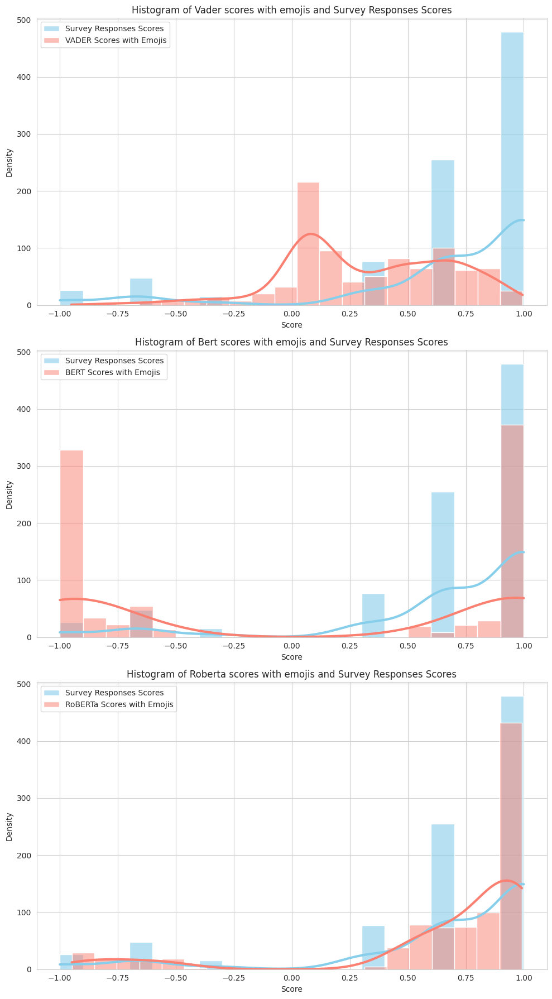
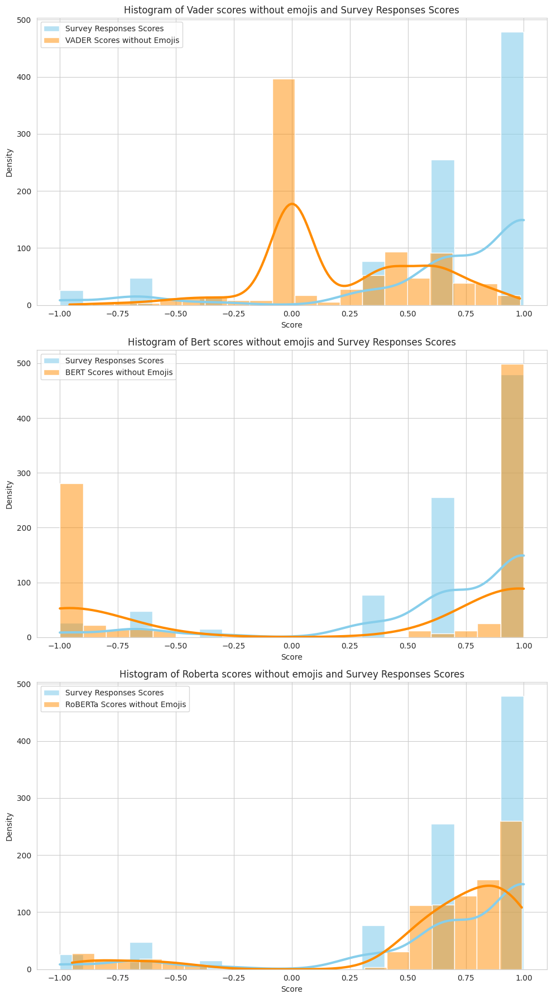
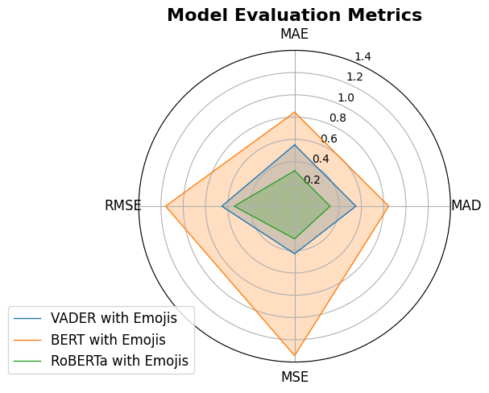
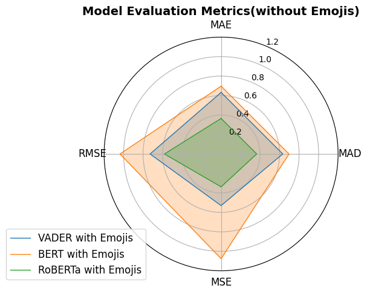
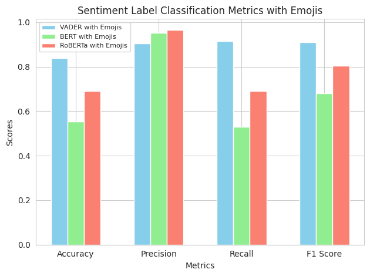
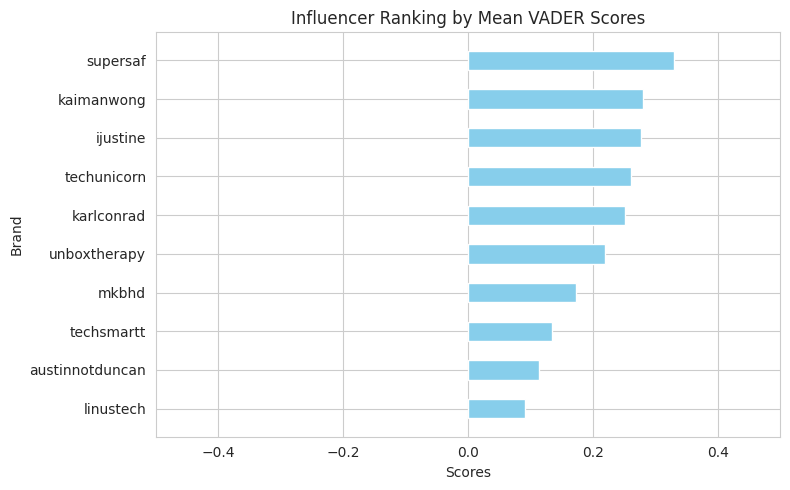
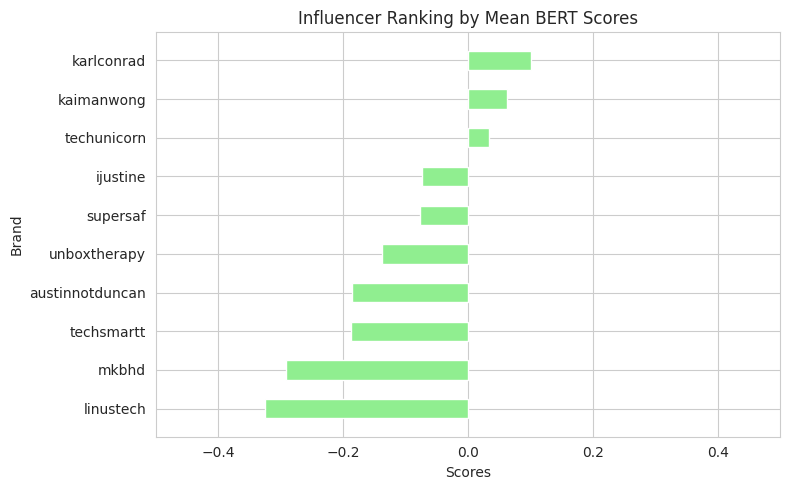
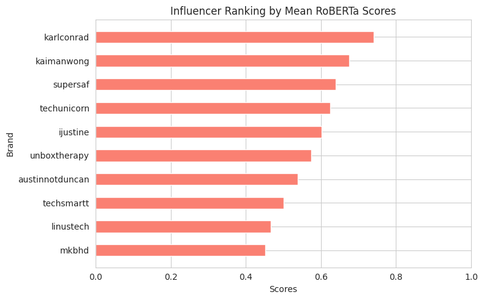

# 📊 Influencer Sentiment Analysis – Visualizations

This section presents key evaluation metrics and visual insights from the sentiment analysis models (VADER, BERT, RoBERTa) used in this research.

---

## 🌀Histogram: Model Evaluation Metrics across Scores

These Histogram charts compares models sentiment classification both with emojis and without, indicating thier individual performance in accurately labeling sentiment as positive or negative, as compared to the Survey results that are used as ground-truth sentiment labels. These histograms further allow an easy analysis of the models skewness errors e.g VADER tends to gravitate towards neutural labels rather than polarized labels

---

## Model Errors

MAE, MAD, MSE, RMSE for all models with and without emojis in a Radial chart (tighter fit indicates lower error)

Accuracy, Precision, Recall and F1 Scores from actual survey responses for each model.

---

## ⚖️ Bar Plot: Mean Squared Error (MSE)

MSE gives greater weight to larger errors. Lower values reflect higher model accuracy.

---

## 🔍 Scatter Plot: Predictions vs Actuals

Visual comparison of predicted scores vs real sentiment scores. The closer to the diagonal line, the more accurate the prediction.

---

## 📈 Line Plot: Sentiment Trends Over Responses

This line plot captures how sentiment predictions vary across the sequence of influencer responses.

---

## 📦 Influencer Rankings by Mean Scores across Models

Influencer Rankings by Mean Sent Scores vary by the models used for sentiment analysis. Since RoBERTa has the least error and the best performance, its rankings can be considered most accurate.

---

## 💡 Summary

These visualizations demonstrate the comparative strengths and weaknesses of traditional vs transformer-based sentiment models, especially in handling emoji-enhanced input.

