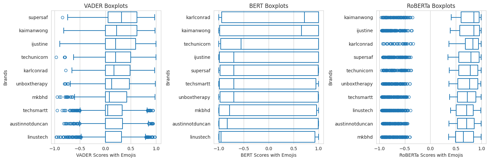

# 📊 Influencer Sentiment Analysis – Visualizations

This section presents key evaluation metrics and visual insights from the sentiment analysis models — VADER, BERT, and RoBERTa — used in this research. Both emoji-enhanced and emoji-removed inputs were analyzed to assess model performance relative to human-labeled survey scores.

---

## 🌀 Histogram: Model Evaluation Score Distributions

The following histograms illustrate how each model classifies sentiment scores, both with and without emojis. These charts reveal trends in classification behavior and highlight skewness or bias:

VADER, for instance, often gravitates toward neutral scores rather than more polarized sentiments.

Comparing these with survey ground-truth labels offers a clearer picture of each model’s alignment with human perception.

---

## 📉 Model Error Metrics

The radial (spider) charts below compare the MAE, MAD, MSE, and RMSE values across models:

A more compact, centered shape indicates lower error and better performance.

RoBERTa consistently outperforms both BERT and VADER, regardless of whether emojis are included.

## 🧪 Model Classification Metrics

The following bar chart shows Accuracy, Precision, Recall, and F1 Score based on actual survey responses, providing a standard classification performance breakdown for each model.

## 🏆 Final Influencer Rankings Across Models

# 📦 Box Plot: Model-Based Influencer Rankings

This box plot compares how each model ranks influencers based on average sentiment scores from the test set, highlighting consistency and variability across models.

# Mean Sentiment Bar Charts

The final visualizations below show how influencer rankings shift depending on the sentiment model used:

Rankings differ across models.

Since RoBERTa demonstrated the lowest error and highest consistency, its rankings are considered most reliable.

---

## 💡 Summary

These visualizations illustrate the comparative strengths and limitations of traditional (VADER) versus transformer-based (BERT, RoBERTa) sentiment models. Emoji presence plays a critical role, and RoBERTa, in particular, demonstrates robust performance in aligning with human-labeled sentiment — especially when emojis are included.

